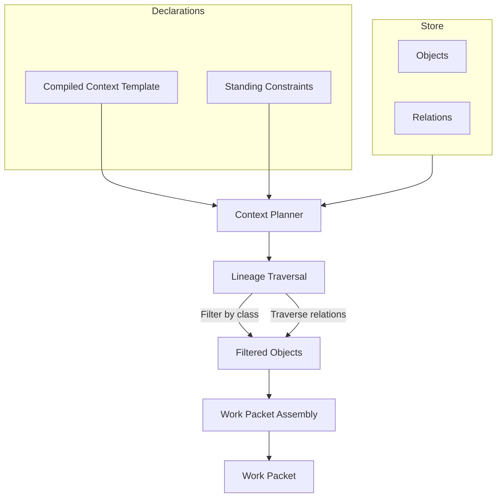

# Context Compilation

When a model summarizes a document, what should it be allowed to see? The full repository? Everything tagged "relevant"? Whatever the retrieval system found?

In most AI systems, the answer is vague: the model sees whatever context was assembled at runtime, and nobody can prove exactly what was included or excluded. That's retrieval. It asks "what might be relevant?" and returns a best guess.

Context compilation asks a different question: **what is allowed for this specific operation?**

## How It Works

Earmark compiles context from four declared inputs:

- **Objects** in the corpus, filtered by class (e.g., only `finding` objects, not `source_note` objects)
- **Relations** between objects (e.g., traverse `derived_from` links to bring in lineage)
- **Standing constraints** (e.g., only include objects with `accepted` review status)
- **Compiled context templates** that define all of the above as a reusable declaration

The result is a **work packet**: a bounded set of objects with provenance information, ready for a runtime to process.



## A Concrete Example

In the research synthesis demo, there are two compiled context templates:

**`source_notes_for_extraction`** — admits only `source_note` objects. This is what the finding-extraction step sees.

**`findings_for_summary`** — admits only `finding` objects and their `derived_from` relations. This is what the summarization step sees.

The summarization step cannot see the original source notes. It receives only the findings that were extracted and validated in the previous stage. That narrowing is not an accident — it's declared in the compiled context template.

## Why It Matters

**You can prove what a model saw.** The compiled context is a deterministic function of declarations and corpus state. If someone asks "did the model have access to the confidential intake notes?" you can answer definitively.

**Smaller context reduces noise.** A summarizer that sees only verified findings produces better output than one that also sees raw interview transcripts, private annotations, and unrelated objects.

**Different stages see different things.** A triage step might see raw intake data. A routing step might see only the extracted symptoms. A reporting step might see only reviewed findings. Each stage has its own compiled context template.

## Declaring a Compiled Context

A compiled context template is a YAML file:

```yaml
name: findings_for_summary
version: 0.2.0
description: Compile findings for summarization.
select:
  classes:
    - finding
  standing: {}
  relations:
    - derived_from
  time_range: null
group_by: []
render:
  mode: work_surface_compilation
  manifest_format: json
  prose_template: null
visibility:
  include_lineage: true
  include_constraints: true
  include_provenance: true
```

The `select` block says: include `finding` objects and traverse `derived_from` relations. Nothing else gets in.

## See Also

- [Staged Execution](staged-execution.md) — how transitions use compiled context
- [Handoffs](handoffs.md) — how context narrows between stages
- [Research Synthesis Demo](../tutorials/research-synthesis-demo.md) — see context compilation in action
