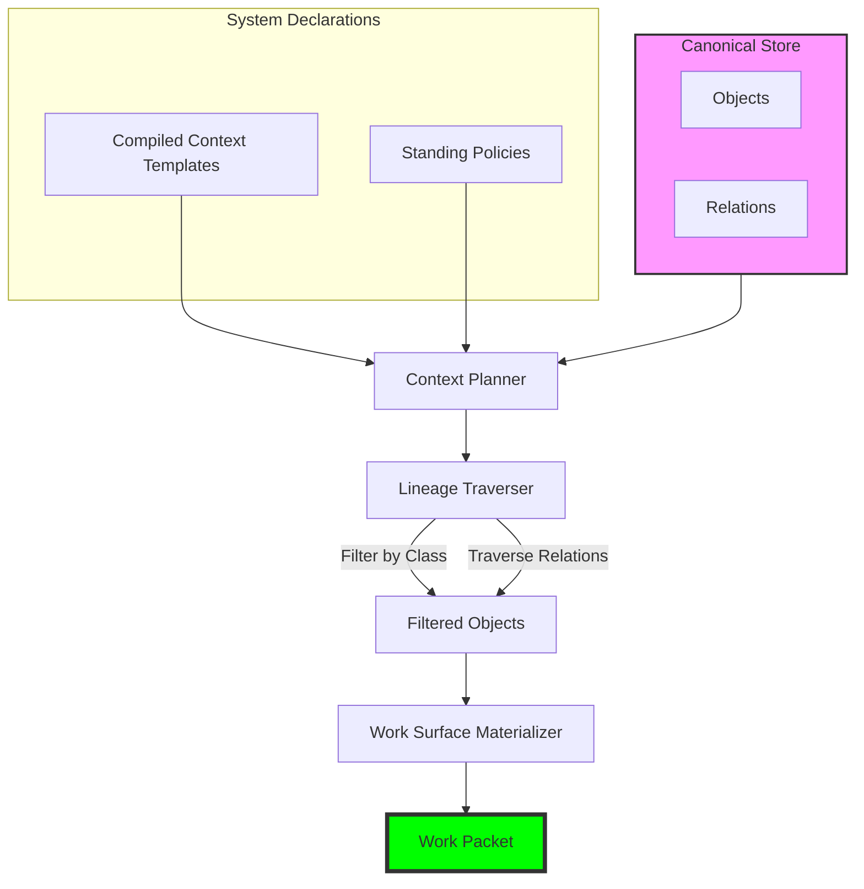

# Concept: Context Compilation

Context compilation is the process of building a bounded, admissible work surface for an AI runtime.

Unlike retrieval-based methods (RAG), which ask "what might be relevant?", context compilation asks **"what is admissible for this specific operation?"**.

## The Core Idea

In Earmark, a runtime never sees the entire corpus. Instead, it sees a **compiled context** that has been filtered, traversed, and bounded according to declarations. This ensures that:
- Hidden assumptions from irrelevant objects are not inherited.
- Sensitive data is excluded by default.
- Lineage and provenance are explicitly tracked for every admitted object.

## How it Works

Context is compiled through a combination of selection rules and traversal patterns:

## Compilation Mechanisms

### 1. Compiled Context Templates
These are declared YAML files that specify which classes and relations are admitted. They define the "shape" of the admissible surface.

### 2. Connected Traversal
The system can start from a "root" object and traverse relations (e.g., `derived_from`) to a specific depth to bring in necessary lineage without exposing the whole graph.

### 3. Standing Constraints
Policies can exclude objects that are not in a specific state (e.g., "only admitted if `standing_review` is `accepted`").

## Why it Matters

1. **Governance**: You can prove exactly what a model saw.
2. **Performance**: Smaller, more focused context reduces noise and token cost.
3. **Safety**: Prevents "leakage" of context from unrelated tasks.

## See Also
- [Tutorial: Research Synthesis](../tutorials/research-synthesis-demo.md)
- [Concept: Handoffs](handoffs.md)
- [Reference: Compiled Context Declaration](../reference/schemas.md#compiled-context-template)
