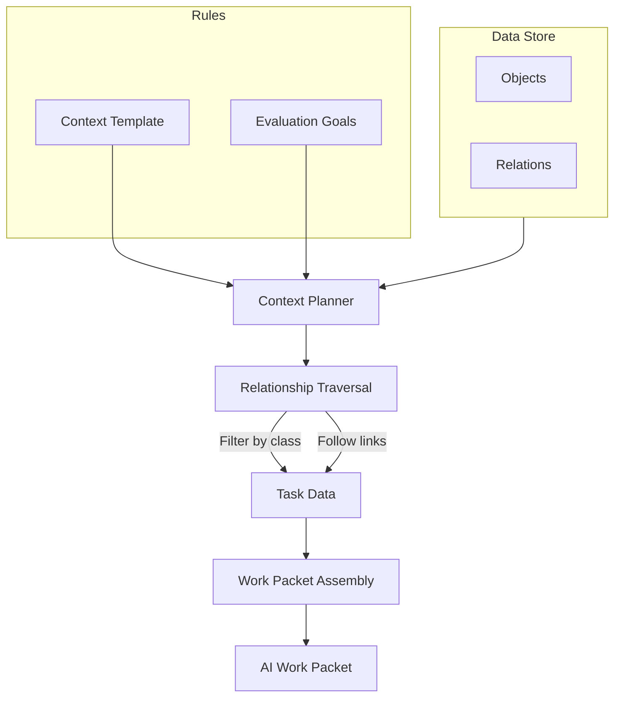

# Task-Specific Context

When an AI model summarizes a document, what should it be allowed to see? The full database? Everything tagged "relevant"? Whatever a search engine retrieved?

In most AI systems, the answer is vague: the model sees whatever context happened to be assembled at runtime. Nobody can prove exactly what was included or excluded.

Earmark uses **task-specific context** to answer a different question: **Exactly what is required for this specific operation?**

## Rules for Visibility

Instead of guessing what is relevant (search), Earmark compiles context based on **declared rules**:

- **Class Filters**: Only include `findings`, not raw `source_notes`.
- **Relationship Traversal**: Follow "lineage" links to bring in supporting evidence, but stop there.
- **Evaluation Gates**: Only include data that has been "verified" or "reviewed".

The result is a **Work Packet**: a strictly bounded set of data with full provenance, ready for an AI agent to process.



## Why It Matters

**Determinism**: You can prove exactly what the AI saw. If a model hallucinates or leaks sensitive data, you can audit the specific context template that was used.

**Reduced Noise**: An AI that sees only verified facts produces better results than one overwhelmed by raw transcripts, private notes, and unrelated data.

**Controlled Narrowing**: A triage AI sees raw data. A reporting AI sees only reviewed findings. Each stage of the "work spine" uses a context template tailored to its specific responsibility.

## Declaring a Context Template

Context templates are defined in YAML. They act as a firewall for your AI workflows:

```yaml
name: findings_for_summary
description: Target only verified findings and their lineage.
select:
  classes:
    - finding
  relations:
    - derived_from
  lifecycle:
    - verified
```

The `select` block ensures the AI receives the `finding` objects and follows their `derived_from` links, but is physically unable to see anything else in the workspace.

## Related

- [The Durable Work Spine](staged-execution.md) — how transitions use task-specific context
- [Carrying Work Forward](handoffs.md) — how context narrows between stages
- [Research Synthesis Demo](../tutorials/research-synthesis-demo.md) — see task-specific context in action
