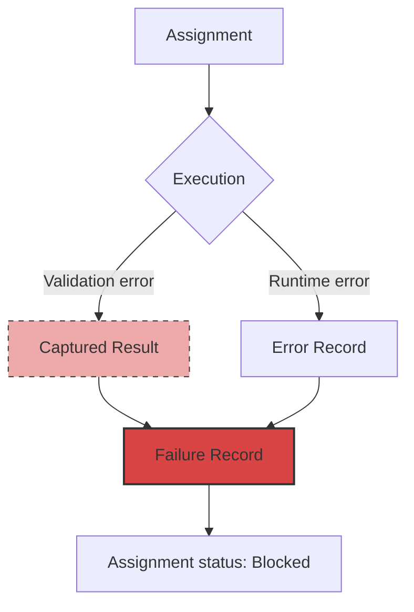

# Learning from Failure

In most AI systems, failed work just disappears. A model produces bad output, the system retries or crashes, and the evidence is buried in a log file. You can't easily audit what went wrong or use the failure to improve the next run.

In Earmark, **failures are durable evidence**. When a task fails — whether due to a model error, a validation rule, or a timeout — the system preserves the exact state and links it to the work that produced it.

## The Evidence Trace



A failure record links three things:
1. **The Attempt**: What the AI was trying to do.
2. **The Result**: The exact output that was rejected (so you can audit it).
3. **The Reason**: Why the system rejected it (schema violations, policy blocks, etc.).

## Types of Failures

- **Validation Mismatch**: The AI produced output, but it violated your declared rules (e.g., "missing required finding summary").
- **Execution Error**: The model provider timed out or returned unparseable text.
- **Policy Block**: A lifecycle rule prevented the work from moving forward (e.g., "unreviewed data cannot be summarized").

## Inspecting Failures

You can query and explain failures just like any other object:

```bash
# List all failures in the workspace
em failure list

# Get a plain-language explanation of a specific failure
em failure explain <failure_id>
```

## Why It Matters

**Failed work is not waste; it is feedback.** 

- A validation failure tells you your AI prompt needs more clarity.
- An execution error tells you your infrastructure needs adjustment.
- A policy block tells you where your human-in-the-loop process is slowing down.

By keeping failure records durable and linked — rather than buried in logs — Earmark makes AI workflows truly governable.

## See Also

- [The Durable Work Spine](staged-execution.md) — the lifecycle that captures failures
- [CLI Reference](../reference/cli.md) — failure inspection commands
