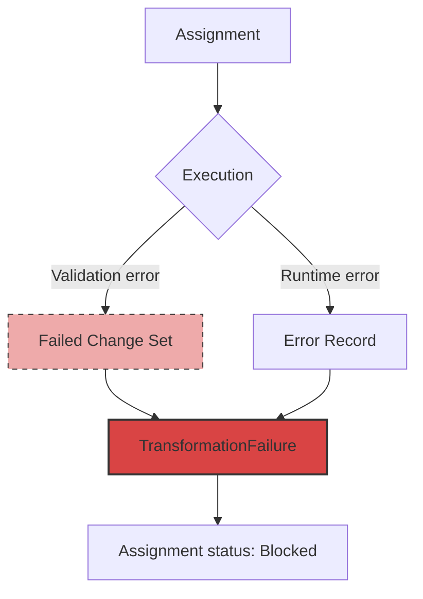

# Failures

In most AI systems, failed work just disappears. The model produced bad output, the orchestrator retried or moved on, and nobody can inspect what went wrong. The error might show up in a log file. It won't show up as something you can audit, link to the input that caused it, or use to improve the next run.

In Earmark, failures are durable artifacts. When a transition fails — bad output, validation error, provider timeout — the system persists the evidence and links it to the assignment and change set that produced it.

## The Failure Trace



A failure record links three things: the assignment that was attempted, the change set that was produced (even if it's invalid), and the error that caused the failure.

## Types of Failures

**Validation failures.** The model produced output, but it violated a declared rule — a missing required field, an undeclared class, a relation that isn't allowed by the schema. The invalid change set is persisted so you can see exactly what the model tried to do.

**Execution errors.** The runtime crashed, timed out, or returned something unparseable.

**Policy blocks.** A standing policy prevented the transition — for example, "no unreviewed findings may be used in summaries."

## Inspecting Failures

```bash
# List failures
em failure list

# Explain a specific failure
em failure explain <failure_id>
```

A failure explanation shows:
- What went wrong
- Which assignment failed
- The change set that was rejected (if any)
- Suggested next steps

## Recovery

Because failures persist as state, you can recover from them:

- **Resume** — re-try the same assignment, perhaps with a different model or fixed instruction.
- **Supersede** — replace the failed work with a new assignment that takes its place.

The failed change set remains in the store for audit even after recovery. Nothing is overwritten.

## Why It Matters

Failed work is not waste. It's evidence. A validation failure tells you the model misunderstood the output contract. An execution error tells you the provider configuration is wrong. A policy block tells you the input data isn't ready for this stage yet.

Keeping that evidence durable and linked — rather than buried in a log — is what makes the system governable.

## See Also

- [Staged Execution](staged-execution.md) — the lifecycle that produces failures
- [CLI Reference](../reference/cli.md) — failure inspection commands
