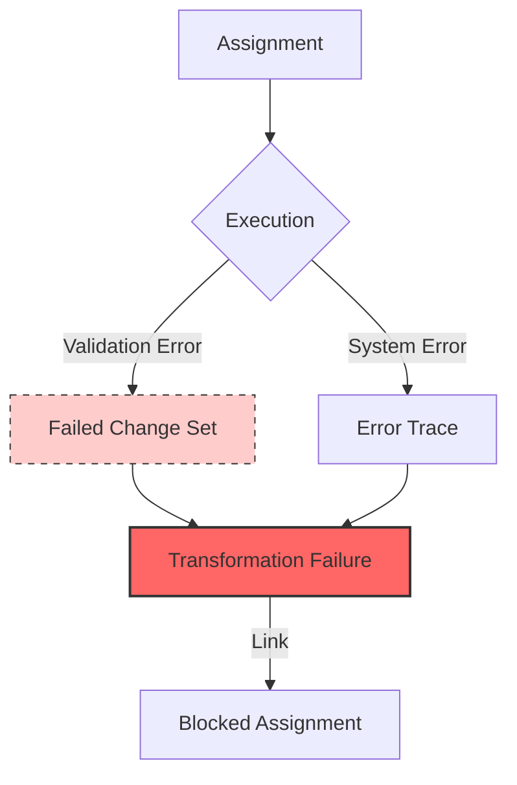

# Concept: Failures

Failures in Earmark are not just logs or error messages; they are **first-class canonical artifacts**.

When a transition fails—whether because of a model hallucination, a validation error, or a system timeout—the system persists the evidence so it can be audited, repaired, or bypassed.

## The Failure Trace

A failure record links all the evidence needed to understand why a transition was blocked.



## Types of Failures

### 1. Validation Failures
The model produced output, but it violated a declared rule (e.g., missing a required field, or using an undeclared class). The system saves the "bad" output in a **Failed Change Set** so you can see exactly what the model tried to do.

### 2. Execution Errors
The runtime itself crashed, timed out, or returned an unparseable response.

### 3. Policy Blocks
A transition was attempted, but a standing policy (e.g., "no unreviewed findings allowed in summaries") blocked it.

## Inspecting Failures

The CLI provides tools to audit and explain failures:

```bash
# List all failures
em audit failures

# Explain a specific failure
em failure explain <failure_id>
```

A failure explanation will show:
- The error message.
- The assignment that failed.
- The change set (if any) that was rejected.
- The next suggested commands for the operator.

## Recovery and Continuation

Because failures are durable, you can **resume** or **supersede** them:

- **Resume**: Re-try the same assignment (perhaps with a different model).
- **Supersede**: Replace the failed work with a manual correction or a different approach.

## Why it Matters

In most AI systems, failed work just disappears or clutters up the chat history. In Earmark, failures are "earmarked" as state, ensuring that **nothing is lost** and **accountability is maintained**.

## See Also
- [Concept: Staged Execution](staged-execution.md)
- [Reference: CLI Reference](../reference/cli.md)
