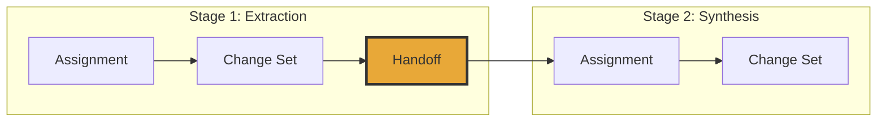

# Handoffs

A handoff is the artifact that bridges two stages of work. It defines exactly what the next stage is allowed to see — nothing more.

## The Problem It Solves

In a typical AI pipeline, Stage 2 "continues" by reading the chat history or by receiving whatever the orchestrator decides to forward. There's no explicit contract about what's included and what's excluded.

A handoff makes that contract explicit. It says:

- These are the objects the next stage may use.
- These are the relation types it may traverse.
- These are the constraints that apply.
- Everything else is out of scope.



## What's in a Handoff

A `HandoffManifest` contains:

- **Root objects** — the specific objects targeted for successor work
- **Inherited inputs** — objects from the previous stage that should remain in scope
- **Created objects** — new objects produced by the previous stage (e.g., extracted findings)
- **Allowed classes** — which object types the successor may see
- **Allowed relations** — which relation types may be traversed
- **Required checks** — validations the successor must perform

## How Context Narrows

This is the key idea. Consider a two-stage workflow:

```
source_note → finding → summary
```

Stage 1 sees the raw source notes and produces findings. The handoff carries the findings forward but **does not include the source notes**. Stage 2 — the summarizer — works only from findings.

Why? Because the summarizer's job is to synthesize verified claims, not to re-read raw material. If the findings are wrong, the right fix is to re-run Stage 1, not to give Stage 2 more context.

This narrowing is not a limitation. It's the design.

## Using Handoffs

Inspect what a handoff carries:

```bash
em handoff explain <handoff_id>
```

Continue work from a handoff:

```bash
em workflow run <workflow_id> --system-id <system_id> --handoff <handoff_id>
```

### Handoff Continuation

A handoff supports two styles of continuation:

**Cross-workflow continuation.** When the handoff was produced by a terminal transition (no outgoing edges), its `to_transition_id` is `None`. Running with `--handoff` in this case feeds the handoff's bounded objects into the target workflow's entry transitions. This is useful for chaining independent workflows.

**Within-workflow continuation.** When the handoff names a successor transition via `to_transition_id`, the engine starts execution directly from that transition instead of restarting at the workflow's entry transitions. Predecessor transitions are not re-executed. The run produces a `continuation` timeline event recording the handoff origin.

```bash
# Continue from a handoff within the same workflow
em workflow run <workflow_id> --system-id <system_id> --handoff <handoff_id>
```

The continuation run:
- Validates that the handoff's target transition exists in the selected workflow
- Seeds the ready queue at the target transition (not at entry transitions)
- Pre-populates predecessor transitions as already executed
- Rebuilds the compiled work surface from the handoff's template reference
- Uses the bounded input objects reconstructed from the handoff manifest

You can re-run from the same handoff multiple times — with a different model, different parameters, or after fixing the instruction.

## Why It Matters

**Isolation.** Stages are independent. Stage 2 doesn't inherit Stage 1's prompt, internal reasoning, or error state. It inherits only the declared handoff surface.

**Resumption.** If Stage 2 fails, the Stage 1 handoff is still there. Fix the problem and retry without re-running everything.

**Collaboration.** Different stages can be handled by different runtimes, different models, or different people. The handoff is the contract between them.

## See Also

- [Staged Execution](staged-execution.md) — the lifecycle that produces handoffs
- [Failures](failures.md) — what happens when a stage doesn't produce a handoff
- [Artifact Types](../reference/artifact-types.md) — HandoffManifest fields
