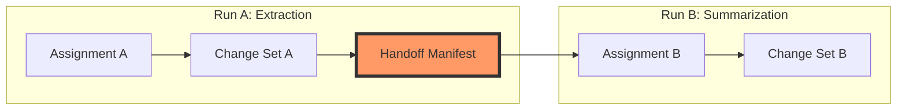

# Concept: Handoffs

A handoff is a durable artifact that defines the bounded continuation surface for successor work.

In a staged system, the output of one transition is not just a pile of objects; it is a **Handoff Manifest** that tells the next transition exactly what it is allowed to see and do.

## The Continuation Bridge

Handoffs bridge the gap between two independent execution runs, ensuring that context remains bounded and lineage remains intact.



## What's in a Handoff?

A `HandoffManifest` contains everything needed to reconstruct the admissible work surface for the next step:

- **Root Objects**: The specific objects targeted for successor work.
- **Inherited Inputs**: Objects from the previous stage that should remain in scope.
- **Created Objects**: New objects produced by the previous stage (e.g., findings).
- **Admissible Classes**: A whitelist of object classes the successor is allowed to see.
- **Allowed Relations**: The types of relations that can be traversed.
- **Required Checks**: Validations that the successor must perform.

## Boundedness as a Standard

Runtimes should treat handoffs as the **only** source of truth for continuation. 

By continuing from a handoff rather than ambient "chat memory," you ensure that the second model in a pipeline doesn't inherit irrelevant noise or "hallucinate" context from the first model's internal reasoning.

## Usage

In the CLI, you can inspect a handoff to see what it carries:

```bash
em handoff explain <handoff_id>
```

And you can use a handoff to start a new workflow run:

```bash
em workflow run <workflow_id> --handoff <handoff_id>
```

## Why it Matters

1. **Isolation**: Stages are mathematically isolated; Stage B only knows what Stage A explicitly handed forward.
2. **Resumption**: You can re-run Stage B multiple times from the same Stage A handoff.
3. **Collaboration**: Different agents (or a human and an agent) can handle different stages of the same work.

## See Also
- [Concept: Staged Execution](staged-execution.md)
- [Reference: Artifact Types](../reference/artifact-types.md)
