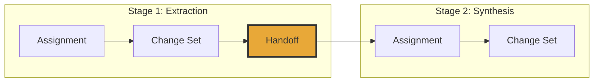

# Carrying Work Forward

In Earmark, work moves forward through **coordinated transitions**. When one stage of work finishes, it passes a specific set of validated data to the next stage — and nothing else.

## The Problem It Solves

In most AI pipelines, Stage 2 "continues" by reading the entire chat history. This often includes messy internal reasoning, irrelevant context, or errors from Stage 1. There is no explicit contract about what is actually being handed off.

Earmark makes this contract explicit:

- **Strict Visibility**: The next stage see *only* what you allow it to see.
- **Validated Input**: You can verify the data before the next stage even starts.
- **Task Isolation**: Stage 2 shouldn't have to "ignore" Stage 1's mistakes.



## What's in a Handoff?

A handoff defines the **task-specific context** for the next stage. It contains:

- **Root Objects**: The specific targets for the next step.
- **Derived Evidence**: Data produced by the previous stage (e.g., extracted findings).
- **Admitted Classes**: The specific types of objects the AI is allowed to work with.

## How Context Narrows

The key to high-quality AI results is **narrowing the focus**. Consider this flow:

`source_note` → `finding` → `summary`

1. **Stage 1** reads the raw source notes and produces findings.
2. The **Handoff** carries the findings forward, but **excludes the source notes**.
3. **Stage 2** (the summarizer) works *only* from the findings.

Why? Because the summarizer's job is to synthesize verified evidence, not to re-interpret raw, potentially misleading material. This ensures that the final summary is based strictly on what has been validated.

## Using Handoffs

Inspect a handoff's payload:
```bash
em handoff explain <handoff_id>
```

Continue work from a specific handoff:
```bash
em workflow run <workflow_id> --system-id <system_id> --handoff <handoff_id>
```

---

## Why It Matters

- **Isolation**: Each stage is an independent, verifiable unit.
- **Restartability**: If Stage 2 fails, Stage 1's work is safe. You can retry Stage 2 immediately from the handoff.
- **Human Collaboration**: A human can review a handoff before it's passed to the next AI stage.

## See Also

- [The Durable Work Spine](staged-execution.md) — the lifecycle that produces handoffs
- [Learning from Failure](failures.md) — what happens when a stage doesn't move forward
- [Quickstart](../tutorials/quickstart.md) — see a handoff in action
