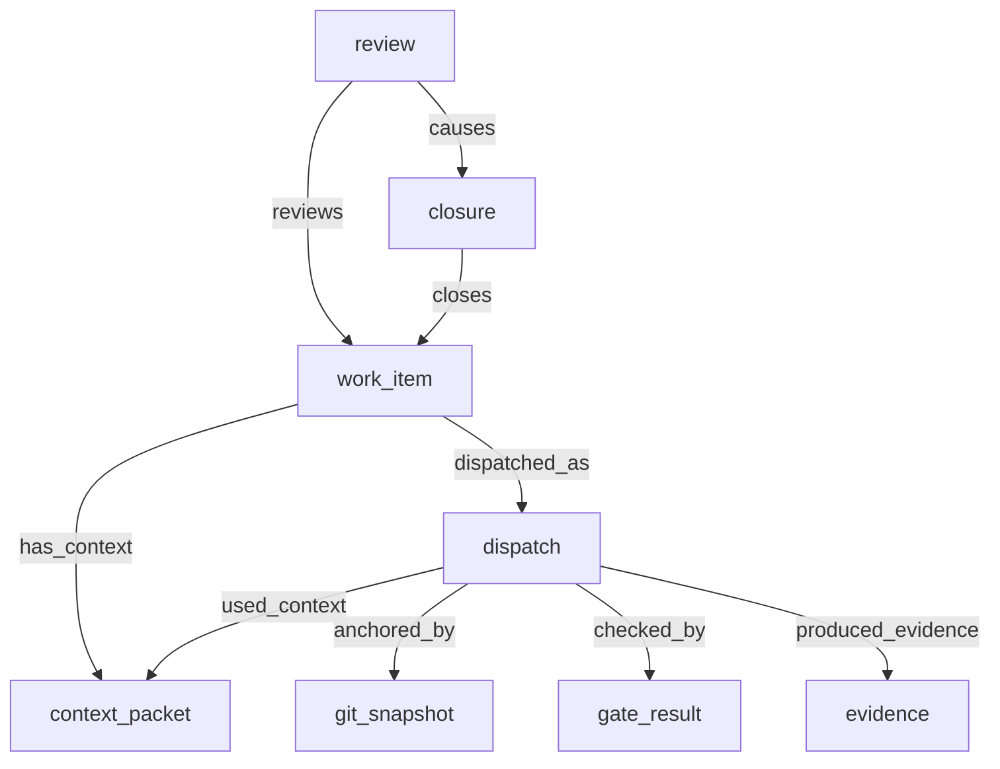

# Native Orchestration

Earmark includes a stable, self-hosting orchestration layer designed specifically for managing long-running AI work. This layer ensures that every execution attempt is recorded, verified, and linked to its source code and resulting evidence.

---

## 1. The Workflow Spine

The Earmark orchestration ledger follows a dispatch-centered model, ensuring that every step in the AI lifecycle is trackable:



### Key Components

- **Work Item (`work_item`)**: The durable record of a task (e.g., "Implement authentication").
- **Context Packet (`context_packet`)**: The exact set of instructions and data handed to the AI.
- **Dispatch (`dispatch`)**: A specific execution attempt. Records who ran the task and when.
- **Git Snapshot (`git_snapshot`)**: Captures the exact code state used for the run.
- **Gate Result (`gate_result`)**: Records the outcome of automated tests and checks.
- **Review & Closure**: The human or system decision to accept the work and close the item.

---

## 2. Quick CLI Reference

The orchestration toolset is exposed via the `em orchestration` surface:

```bash
# Ingest a task from a JSON file or ad-hoc arguments
em orchestration ingest-task pf-s1 --title "Public Facelift"

# Record the code state and verification results
em orchestration capture-git --task-id <ID> --dispatch-id <ID> --phase pre-dispatch
em orchestration record-gate --task-id <ID> --dispatch-id <ID> --command "cargo test" --status pass

# Review and close the work
em orchestration review <ID> --decision accepted --comment "Final docs approved."
```

---

## 3. Why Native Orchestration?

1. **Governance**: Every AI action is recorded in a tamper-evident ledger.
2. **Reproducibility**: Link every generated artifact back to the exact code commit and input context.
3. **Observability**: Use `em orchestration explain-dispatch` to see the full life-story of a specific run.
4. **Resilience**: If a background run fails, the ledger preserves the logs and state for immediate debugging.

---

- [Durable Work Spine](staged-execution.md) — how transitions work
- [Learning from Failure](failures.md) — how failed runs are recorded
