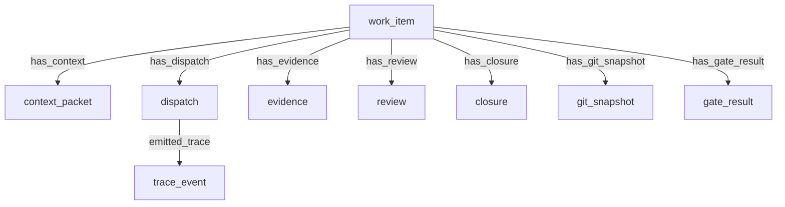

# Native Orchestration Ledger

The Earmark Native Orchestration Ledger implements a fully sovereign, auditable, and versioned task execution history natively inside Earmark's canonical storage and derived SQLite index. 

Rather than relying on external task trackers, Earmark represents development lifecycles, executor dispatches, and verification gates directly as structured, linked Earmark objects.

---

## 1. Native Entities

The ledger is built upon nine native object classes declared dynamically under the development orchestration system:



### 1.1 `work_item`
Represents the durable unit of planned or delegated work.
* **Fields**: `task_id`, `title`, `goal`, `status` (`proposed`, `ready`, `dispatched`, `in_progress`, `blocked`, `implemented`, `reviewed`, `closed`), `priority`.

### 1.2 `context_packet`
The bounded set of instructions and file/object references compiled and handed off to an executor.
* **Fields**: `work_item_id`, `title`, `instructions`, `included_refs`.

### 1.3 `dispatch`
Records a specific assignment of a work item to an executor or runtime (e.g. `opencode`, `codex`, `human`).
* **Fields**: `work_item_id`, `executor`, `attempt`, `status`.

### 1.4 `trace_event`
Chronologically logs a factual, visible step in execution.
* **Fields**: `work_item_id`, `dispatch_id`, `event_type` (`started`, `failed`, `completed`), `message`.

### 1.5 `evidence`
Stores or references verifiable outcomes produced by the executor (e.g., git diff, test stdout).
* **Fields**: `work_item_id`, `dispatch_id`, `evidence_type` (`git_diff`, `test_output`), `description`.

### 1.6 `review`
Maintains the outcome of human or programmatic verification against acceptance criteria.
* **Fields**: `work_item_id`, `verdict` (`approved`, `rejected`), `comment`.

### 1.7 `closure`
Ratifies final disposition of the work item.
* **Fields**: `work_item_id`, `disposition` (`completed`, `deferred`), `summary`.

### 1.8 `git_snapshot`
Captures exact state of git repository before or after task execution.
* **Fields**: `task_id`, `task_object_id`, `phase`, `commit`, `base`, `head`, `branch`, `dirty`, `status_short`, `diff_stat`, `captured_by`.

### 1.9 `gate_result`
Records outcomes of automated gate verification scripts (e.g. lints, unit tests).
* **Fields**: `task_id`, `task_object_id`, `command`, `status`, `log_path`, `log_excerpt`, `recorded_by`.

---

## 2. CLI Command Reference

Verify, trace, and inspect execution components natively from the CLI:

### 2.1 Capture Git Snapshot
Record a git snapshot associated with a task:
```bash
earmark orchestration capture-git --task-id <TASK_ID_OR_OID> --phase <before|after|review|manual> [--commit <hash>] [--base <base>] [--head <head>] [--include-diff-stat]
```

### 2.2 Record Gate Result
Log an automated gate execution result:
```bash
earmark orchestration record-gate --task-id <TASK_ID_OR_OID> --command <command> --status <pass|fail|skipped> [--log <path>]
```

### 2.3 List Orchestration Tasks
List work items and implementation tasks:
```bash
earmark orchestration list [--status <status>] [--include-closed]
```

### 2.4 Show Component Details
Locates a task and lists all linked context packets, dispatches, traces, git snapshots, gate results, and closures:
```bash
earmark orchestration show <TASK_ID_OR_OID>
```

### 2.5 Chronological Timeline Query
Generates a chronological timeline of every event in a task's lifecycle, ordered by nanosecond-accurate commit timestamps:
```bash
earmark orchestration timeline <TASK_ID_OR_OID>
```

Both commands support `--json` to output machine-readable JSON envelopes ideal for programmatic consumption.

---

## 3. End-to-End Orchestration Tutorial

### Step 1: Initialize the Orchestration Example
Initialize a workspace and activate the sovereign dev orchestration system:
```bash
earmark init
earmark orchestration init-example
```

### Step 2: Ingest a Task
Import a task from Engram or local JSON payload files:
```bash
earmark orchestration ingest-task --source engram <TASK_ID>
```

### Step 3: Run Native Dispatch
Execute the task manifest, capture the git diff, run validation gates, and log evidence natively:
```bash
scripts/dispatch-native.sh --title "My Task" --objective "Implement feature X"
```

### Step 4: Inspect Graph & Timeline
Audit the chronological progression of the work item:
```bash
earmark orchestration timeline <WORK_ITEM_ID>
```
