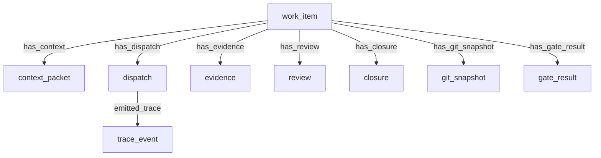

# Native Orchestration Ledger

© 2026 Mikhail Shakhnazarov

## Status

Internal package-candidate / dogfooding surface.

> [!WARNING]
> Native orchestration is currently a **package-candidate**. It is functional for local repository dogfooding but is not considered package-stable until the full lifecycle semantics (review-to-closure, follow-up spawn, and canonical relation grammar) have passed the final promotion gate.

This document describes the native orchestration ledger used to coordinate Earmark development work. It is not part of the canonical product spine. The canonical spine remains:

```text
declarations
  -> bounded context / work surface
  -> staged execution
  -> durable artifacts
  -> derived index
  -> query / audit / report
```

The orchestration surface may be useful for local project self-hosting, executor dispatch, and dogfooding. It must not be treated as a stable user-facing workflow layer until the core semantics are hardened: relation authorization, derived-index rebuild safety, partial workflow status, declaration/runtime contract alignment, and workspace initialization safety.

No orchestration helper may bypass canonical write paths.

---

## 1. Native Entities

The ledger is built upon native object classes declared under the development orchestration system:



### 1.1 `work_item`

Represents the durable unit of planned or delegated development work.

Fields include `task_id`, `title`, `goal`, `status`, and `priority`.

### 1.2 `context_packet`

The bounded set of instructions and file/object references compiled and handed off to an executor.

Fields include `work_item_id`, `title`, `instructions`, and `included_refs`.

### 1.3 `dispatch`

Records a specific assignment of a work item to an executor or runtime, such as `opencode`, `codex`, or a human operator.

Fields include `work_item_id`, `executor`, `attempt`, and `status`.

### 1.4 `trace_event`

Chronologically logs a factual, visible execution step.

Fields include `work_item_id`, `dispatch_id`, `event_type`, and `message`.

### 1.5 `evidence`

Stores or references verifiable outcomes produced by the executor, such as git diff summaries or test output.

Fields include `work_item_id`, `dispatch_id`, `evidence_type`, and `description`.

### 1.6 `review`

Maintains the outcome of human or programmatic verification against acceptance criteria.

Fields include `work_item_id`, `verdict`, and `comment`.

### 1.7 `closure`

Ratifies final disposition of the work item.

Fields include `work_item_id`, `disposition`, and `summary`.

### 1.8 `git_snapshot`

Captures exact git repository state before or after task execution.

Fields include `task_id`, `task_object_id`, `phase`, `commit`, `base`, `head`, `branch`, `dirty`, `status_short`, `diff_stat`, and `captured_by`.

### 1.9 `gate_result`

Records outcomes of automated verification gates such as tests, linters, or smoke scripts.

Fields include `task_id`, `task_object_id`, `command`, `status`, `log_path`, `log_excerpt`, and `recorded_by`.

---

## 2. Current CLI Surface

The current experimental CLI surface includes:

```bash
earmark orchestration init-example
earmark orchestration ingest-task --source native-json task.json
earmark orchestration capture-git --task-id <TASK_ID_OR_OID> --phase <before|after|review|manual>
earmark orchestration record-gate --task-id <TASK_ID_OR_OID> --command "cargo test" --status pass
earmark orchestration list
earmark orchestration show <TASK_ID_OR_OID>
earmark orchestration timeline <TASK_ID_OR_OID>
```

These commands are for internal/dogfooding use. They should not be used to explain the main Earmark product to a new reader.

---

## 3. Internal use pattern

A local development loop may use the orchestration ledger as follows:

```bash
earmark init
earmark orchestration init-example
earmark orchestration ingest-task --source native-json task.json
earmark orchestration capture-git --task-id <TASK_ID> --phase before --include-diff-stat
scripts/dispatch-native.sh --title "My Task" --objective "Implement feature X"
earmark orchestration record-gate --task-id <TASK_ID> --command "cargo test" --status pass
earmark orchestration timeline <TASK_ID>
```

This is a dogfooding workflow, not a stable product tutorial.

---

## 4. Stability Statement

The native orchestration surface is the intended self-hosting direction for Earmark. It is currently in a **dogfooding/candidate** phase. To reach Stable status, it must satisfy the following promotion criteria:

1. **Canonical Lifecycle**: `work_item -> dispatch -> evidence/snapshot/gate -> review -> closure`.
2. **Hardened Relations**: Dispatch-centered causality must be authoritative.
3. **Status Normalization**: Unified vocabulary for execution and review states.
4. **Verified Closure**: Substantive review must produce either complete closure or partial closure with follow-up work.
5. **Nix-Verified**: All commands and the full self-hosting smoke path must pass in a clean Nix environment.
