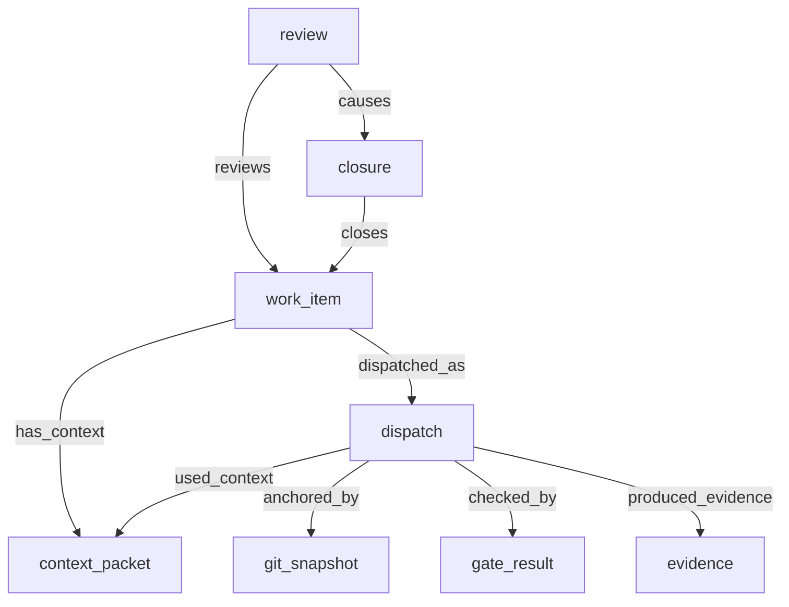

# Native Orchestration Ledger

© 2026 Mikhail Shakhnazarov

## Status

**Stable**. The native orchestration surface is now part of the canonical Earmark self-hosting toolkit.

> [!NOTE]
> This ledger implements the "Single Native Story" for orchestration, alignment with the core product spine (declarations → context → execution → artifacts → index).

---

## 1. Canonical Lifecycle Graph

The orchestration ledger follows a dispatch-centered causality model:



### 1.1 `work_item`
Represents the durable unit of planned development work.
- **Relations**: `has_context`, `dispatched_as`, `has_review`.
- **States**: `proposed`, `ready`, `dispatched`, `under_review`, `closed`, `blocked`.

### 1.2 `context_packet`
The bounded set of instructions and references handed to an executor.
- **Relations**: `used_context` (linked from dispatch).

### 1.3 `dispatch`
Records a specific execution attempt.
- **Relations**: `anchored_by` (to git_snapshot), `checked_by` (to gate_result), `produced_evidence` (to evidence).
- **States**: `queued`, `running`, `succeeded`, `failed`, `cancelled`.

### 1.4 `git_snapshot`
Captures repository state linked to a dispatch.
- **Relations**: `anchored_by` (parent dispatch).

### 1.5 `gate_result`
Records outcomes of automated verification.
- **Relations**: `checked_by` (parent dispatch).

### 1.6 `review` & `closure`
The final verification and disposition of a work item.
- **Relations**: `review -> causes -> closure -> closes -> work_item`.

---

## 2. CLI Reference

The stable orchestration CLI surface includes:

```bash
# Workspace & Declarations
earmark orchestration init-example

# Intake & Preparation
earmark orchestration ingest-task --source native-json task.json
earmark orchestration record-context --task-id <ID> context.json

# Dispatch & Execution
earmark orchestration ingest-manifest manifest.md --task-id <ID> --context-id <ID>
earmark orchestration capture-git --task-id <ID> --dispatch-id <ID> --phase pre-dispatch
earmark orchestration record-gate --task-id <ID> --dispatch-id <ID> --command "test" --status pass
earmark orchestration capture-git --task-id <ID> --dispatch-id <ID> --phase post-dispatch
earmark orchestration ingest-report report.md --task-id <ID> --manifest <DISPATCH_ID>

# Verification & Closure
earmark orchestration review <ID> --decision accepted --comment "Done."
earmark orchestration show <ID>
earmark orchestration timeline <ID>
```

---

## 3. Stability & Compliance

The native orchestration layer satisfy all canonical criteria:
1. **Canonical Lifecycle**: Fully implemented.
2. **Hardened Relations**: Dispatch-centered causality is enforced.
3. **Status Normalization**: Unified vocabulary across all objects.
4. **Verified Closure**: Automatic structural closure via `review -> closure` linkage.
5. **Nix-Verified**: Smoke paths are deterministic and reproducible.
