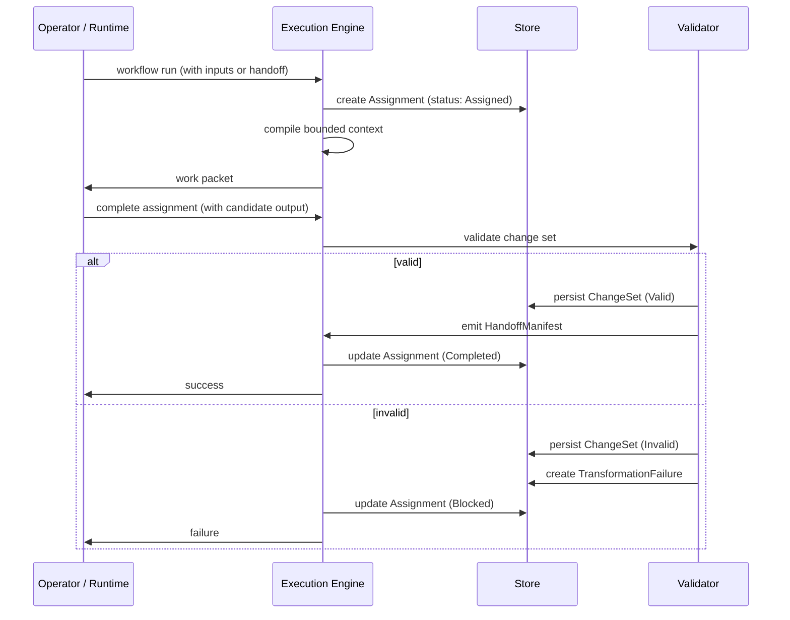

# Staged Execution

Most AI work happens in a single pass: prompt in, response out, hope for the best. If the task is complex — extracting claims from raw notes, then synthesizing a briefing from those claims — the whole thing runs in one long context window and the intermediate steps are invisible.

Earmark breaks that into a sequence of **transitions**, where each stage consumes a bounded input, produces verified output, and emits a handoff for the next stage. Every step leaves behind durable evidence of what happened.

## The Lifecycle

Every transition follows this sequence:

The important part: both paths persist artifacts. When work succeeds, you get a valid change set and a handoff. When work fails, you get an invalid change set and a failure record. Nothing disappears.

## Artifacts

**Assignment** — A claim on a piece of work. Records the transition, the bounded inputs, the runtime that claimed the work, and the current status (`Assigned`, `Completed`, `Blocked`, `Released`, `Expired`, `Superseded`).

**Change Set** — The collection of creates, links, and changes produced by a transition. Persisted whether valid or invalid.

**Failure** — A record linking the failed assignment and change set to the specific error. Created when validation fails or execution errors out.

**Handoff** — Defines the bounded input for the next stage. See [Handoffs](handoffs.md).

## Continuation

The point of staging is **continuation without ambient memory**.

In a chat-based system, Stage 2 continues because the conversation history contains Stage 1's output. In Earmark, Stage 2 continues because it reads a handoff manifest that explicitly defines what it's allowed to see.

That means:
- Stage 2 can run in a different runtime, a different session, or a different model.
- Stage 2 doesn't inherit Stage 1's internal reasoning or side effects.
- You can re-run Stage 2 multiple times from the same Stage 1 handoff.

## Why It Matters

- **Auditability**: every object traces to the assignment and run that created it.
- **Resilience**: if Stage 2 fails, Stage 1's handoff is still there. Resume or retry without re-running everything.
- **Human review**: insert a review gate between any two stages by requiring standing changes before the handoff is accepted.

## See Also

- [Handoffs](handoffs.md) — how bounded continuation works between stages
- [Failures](failures.md) — how failed work is preserved and inspected
- [Quickstart](../tutorials/quickstart.md) — run a staged workflow in 5 minutes
