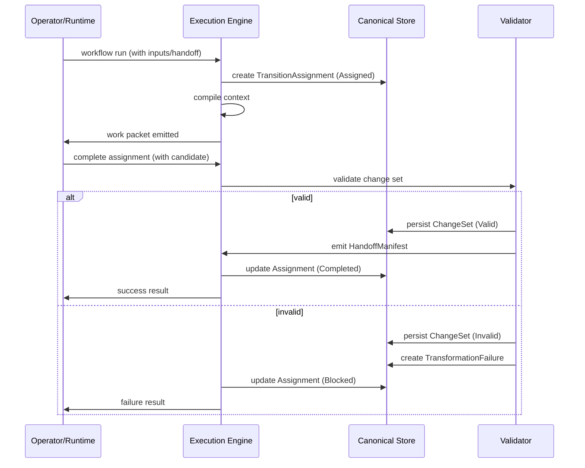

# Concept: Staged Execution

Staged execution is the practice of breaking complex AI tasks into series of bounded, verifiable transitions.

In Earmark, execution does not happen in a single monolithic loop. It happens as a sequence of **transitions**, where each stage consumes a handoff from the previous stage and produces a new artifact for the next.

## The Execution Flow

Every transition follows a strict lifecycle to ensure durability and auditability:

## Key Artifacts

### 1. Transition Assignment
An assignment is a claim on a specific piece of work. It records who is doing the work, which inputs they are using, and the current status (Assigned, Completed, Blocked, etc.).

### 2. Change Set
A change set is the collection of delta operations (create, link, change) produced by a transition. Change sets are persisted even if they fail validation, providing an audit trail of "what went wrong."

### 3. Transformation Failure
When a transition fails (either due to an execution error or a validation failure), a first-class failure record is created. This record links the failed assignment and change set to the specific error message.

## Bounded Continuation

The power of staged execution lies in **continuation**. Instead of a runtime "remembering" what it did in a chat history, it reads a **Handoff Manifest** emitted by the previous stage.

This manifest defines the bounded set of objects and relations that the next stage is allowed to use.

## Why it Matters

- **Auditability**: Every change is linked to a specific assignment and run.
- **Resilience**: If a stage fails, you can resume from the last successful handoff.
- **Governance**: You can insert human-in-the-loop review between any two stages.

## See Also
- [Concept: Handoffs](handoffs.md)
- [Concept: Failures](failures.md)
- [Tutorial: Quickstart](../tutorials/quickstart.md)
