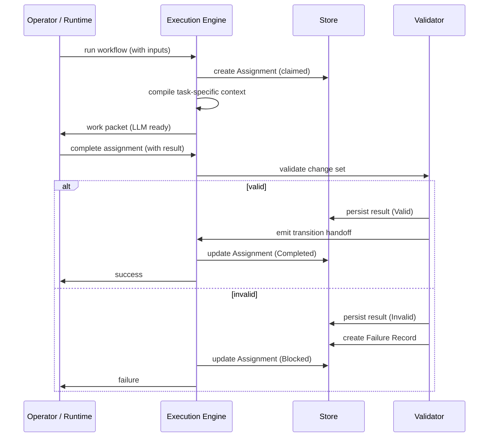

# The Durable Work Spine

Most AI work happens in a single pass: prompt in, response out, hope for the best. If the task is complex — such as extracting claims from raw notes and then synthesizing a briefing — the whole process usually runs in one long, hidden context window. Intermediate steps are invisible and hard to verify.

Earmark solves this by establishing a **durable work spine**. It breaks complex tasks into a sequence of **controlled transitions**, where each stage consumes task-specific inputs, produces verified results, and leaves behind a permanent chain of evidence.

## The Lifecycle

Every transition in the spine follows this verifiable sequence:

The core principle: both paths persist artifacts. When work succeeds, you get a valid result and a handoff for the next stage. When it fails, you get an explicit failure record. No work "disappears" into a chat history.

## Key Artifacts

- **Assignment** — A durable claim on a piece of work. Records the transition, the specific inputs used, and the current status (e.g., `Assigned`, `Completed`, `Blocked`).
- **Change Set** — The exact collection of new objects and relations produced. Persisted regardless of validity for audit purposes.
- **Failure Record** — A link between the failed work and the specific error message. Replaces generic "it didn't work" with actionable evidence.
- **Handoff** — The hand-off of validated data to the next stage of the spine.

## Transitioning Work

The point of the work spine is **transitioning without ambient noise**.

In a traditional chat system, Stage 2 continues because it "remembers" everything in the conversation. In Earmark, Stage 2 continues because it receives a **handoff** that explicitly defines exactly what it is allowed to see.

This means:
- **Clean Handoffs**: Stage 2 doesn't inherit Stage 1's messy reasoning or internal logs.
- **Restartability**: You can restart Stage 2 from the same handoff without having to re-run Stage 1.
- **Verifiability**: Each stage can be evaluated independently before the next one starts.

## Why It Matters

- **Evidence-Based AI**: Every result is backed by a durable chain of source objects.
- **Resilience**: If a later stage fails, the previous validated work is still safe.
- **Audit Trails**: Complete visibility into which AI model did what, when, and with what data.

## See Also

- [Carrying Work Forward](handoffs.md) — how transitions work between stages
- [Learning from Failure](failures.md) — how failed work is preserved and inspected
- [Quickstart](../tutorials/quickstart.md) — start building your own work spine in 5 minutes
