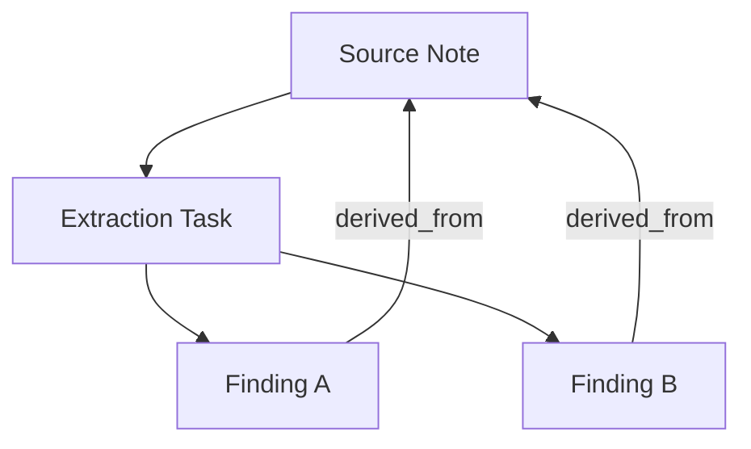

# Example: Evidence Extraction

This example demonstrates how Earmark ensures that AI-extracted findings are always traceable back to their original source material.

## The Scenario

You have a collection of interview transcripts or raw research notes. You want an AI to:
1. **Extract** key claims or "findings."
2. **Link** each finding to the specific paragraph that supports it.
3. **Verify** that no finding is created without an explicit lineage link.

## The Workflow Spine



### The Lineage Rule

In a generic LLM app, the AI might hallucinate a fact that isn't in the source. In Earmark, we enforce **Verification Proofs** at the relationship level.

- **Source**: `finding`
- **Target**: `source_note`
- **Rule**: Every `finding` *must* have at least one `derived_from` relation.

## Task-Specific Context

When the AI performs extraction, Earmark compiles a **Work Packet** that includes:
- The raw `source_note` content.
- The schema for a `finding`.
- The instruction for extraction.

The AI is physically unable to see other unrelated notes or previous extractions, which prevents "cross-contamination" of facts.

## Commands

```bash
# Extract findings from a specific note
em workflow run extraction-spine --with obj_note123

# Inspect the lineage of an extracted finding
em relation list --source-id obj_finding_abc

# See the proof of the relationship
em relation explain obj_rel_xyz
```

## Why it Matters

- **Confidence**: You can click on any finding in your final report and see the exact snippet of text that justified it.
- **Accuracy**: By narrowing the AI's focus to one source at a time, you dramatically reduce the chance of context-mixing hallucinations.
- **Audit**: If a finding is later disputed, the durable relationship record preserves the "proof of extraction" forever.

---

- [Verified Relationships](../concepts/relation-authorization.md) — how lineage is authorized
- [Task-Specific Context](../concepts/context-compilation.md) — how isolation prevents hallucinations
