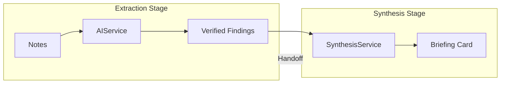

# Example: Multi-Stage Synthesis

This example showcases Earmark's most powerful capability: coordinating multi-stage AI workflows where the output of one stage is the verified input for the next.

## The Scenario: From Raw Notes to a Briefing Card

You want to transform dozens of disorganized interview notes into a single, high-quality "Briefing Card" for a project lead.

1. **Stage 1 (Extraction)**: Extract findings from each note individually.
2. **Stage 2 (Synthesis)**: Summarize all verified findings into a consistent briefing format.

## The Problem with LLM Chains

In a typical chain, you would feed Stage 2 all the original notes + Stage 1's output. The context becomes huge, noisy, and the AI often ignores the extractions in favor of re-interpreting the raw (unverified) notes.

## The Earmark Solution: The Durable Work Spine



### 1. Coordinated Handoffs

When Stage 1 finishes, it produces a **Handoff**. This handoff acts as a filter. It tells Stage 2: "You are allowed to see these `finding` objects, but you are physically blocked from seeing the original `source_note` objects."

This ensures that the Synthesis stage *only* works from data that has already been extracted and (optionally) reviewed by a human.

### 2. Intermediate Verification

Between Stage 1 and Stage 2, you can pause for human-in-the-loop review.

```bash
# Review the findings before they are summarized
em review obj_finding_123 --reason "Accurate extraction."

# Only 'accepted' findings move forward
em standing-request apply --policy review-required
```

## Why it Matters

- **Governance**: You can prove that the final Briefing Card only used findings that were explicitly approved.
- **Reliability**: By narrowing the context at each stage, you eliminate the noise that causes AI "drift" and hallucination in long-running tasks.
- **Resilience**: If the Synthesis stage fails (e.g., due to a model error), you don't have to re-run the expensive Extraction stage. You simply restart from the Stage 1 handoff.

## Commands

```bash
# Run the extraction (Stage 1)
em workflow run extraction-spine --with note_1 note_2

# Carry the work forward (Stage 2)
em workflow run synthesis-spine --handoff <handoff_id>
```

---

- [Carrying Work Forward](../concepts/handoffs.md) — the mechanics of handoffs
- [The Durable Work Spine](../concepts/staged-execution.md) — the lifecycle of a coordinated run
