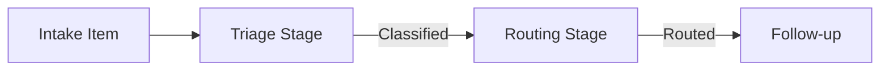

# Example: Triage and Routing

This example demonstrates how Earmark can be used to coordinate the initial triage and routing of incoming requests (e.g., customer support tickets, security alerts, or project intake).

## The Scenario

Imagine a high-volume intake channel where incoming items must be:
1. **Classified** by urgency and department.
2. **Enriched** with relevant historical context.
3. **Routed** to the correct specialized AI agent or human team.

In a typical AI chain, this is often a single, complex prompt that tries to "do it all." In Earmark, we break this into a **Durable Work Spine**.

## The Workflow Spine



### 1. Triage Stage
- **Input**: Raw intake object (e.g., a `support_ticket`).
- **Task**: Identify the topic and urgency.
- **Verification Proof**: The AI must output a `classification` object linked to the ticket.

### 2. Routing Stage
- **Task-Specific Context**: The router sees the original `support_ticket` AND the `classification` results, but *not* irrelevant historical data from other tickets.
- **Handoff**: Stage 1 passes only the verified classification forward.

## Declarations

The system is governed by simple YAML declarations:

```yaml
# Define the relationship
name: classification_of
description: Links a classification to its source intake item.
source: classification
target: support_ticket
authorizing_endpoint: source
```

## Why it Matters

- **Auditability**: If an urgent security alert is misrouted, you can inspect the `dispatch` record of the Triage Stage to see exactly what context the AI had and why it made that decision.
- **Task Isolation**: The Router doesn't need to re-extract the urgency; it works from the validated evidence produced by the Triager.
- **Evaluation**: You can set a "Standing Request" that says: "All high-urgency classifications must be reviewed by a human before routing."

## Commands

```bash
# Ingest a new intake item
em deposit --class support_ticket --body "I cannot access my billing portal."

# Run the triage workflow
em workflow run triage-spine --with <ticket_id>

# Explain the routing decision
em result explain <routing_change_set_id>
```

---

- [The Durable Work Spine](../concepts/staged-execution.md) — how work moves through stages
- [Learning from Failure](../concepts/failures.md) — what happens if triage fails
