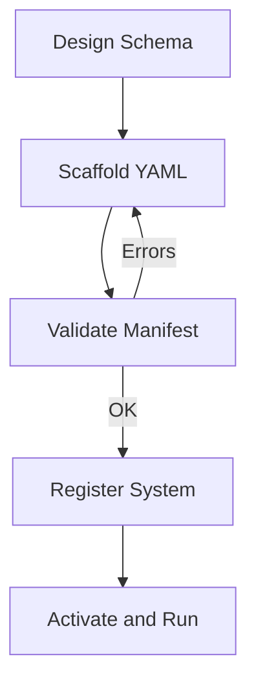

# Tutorial: Building a Domain Definition

This tutorial teaches you how to build your own domain-specific system in Earmark. We will follow the **"Build-Validate-Register-Run"** cycle.

## 1. The Design Phase

Before writing YAML, decide on your core "Alphabet":
- **Classes**: What are the nouns? (e.g., `contract_clause`, `violation_risk`)
- **Relations**: How do they connect? (e.g., `extracted_from`, `violates_policy`)
- **Workflow**: What is the sequence? (e.g., `contract -> clause -> risk_report`)

## 2. Scaffolding your Declarations

Use the `em declare new` command to generate templates for your classes and workflows.

```bash
mkdir -p my_domain/classes
em declare new class contract_clause > my_domain/classes/clause.yaml
em declare new class violation_risk > my_domain/classes/risk.yaml
```

Edit these files to define your schemas and relation rules.

## 3. Creating a System Manifest

A **System Manifest** is the glue that binds your declarations together. Create a `system.yaml` at the root of your domain directory:

```yaml
system_id: my_contract_reviewer
namespace: my_org.legal
title: Contract Policy Reviewer
description: Extract clauses and flag policy violations.

classes:
  - classes/clause.yaml
  - classes/risk.yaml

instructions:
  - instructions/extract_clauses.md
  - instructions/flag_risks.md

workflows:
  - workflows/review_workflow.yaml

runtime_profile:
  execution_surface: local
  work_surface_mode: staged
```

## 4. Validation

Always validate your system before registering it. Earmark will check for missing references, cyclic workflows, and schema errors.

```bash
em declare validate my_domain/system.yaml
```

## 5. Registration and Activation

Once valid, register the system into your Earmark workspace:

```bash
em system register my_domain/system.yaml
```

Activate it to make it the default for your next commands:

```bash
em system activate my_contract_reviewer
```

## 6. Execution

Now you can deposit data and run your new workflow:

```bash
em deposit --class contract --title "Lease Agreement" --body "..."
em workflow run review_workflow --system-id my_contract_reviewer --with <object_id>
```

## Summary of the Cycle



## Next Steps

- Consult the [CLI Reference](../reference/cli.md) for advanced flags.
- Study the [Declaration Schemas](../reference/schemas.md) for all available fields.
