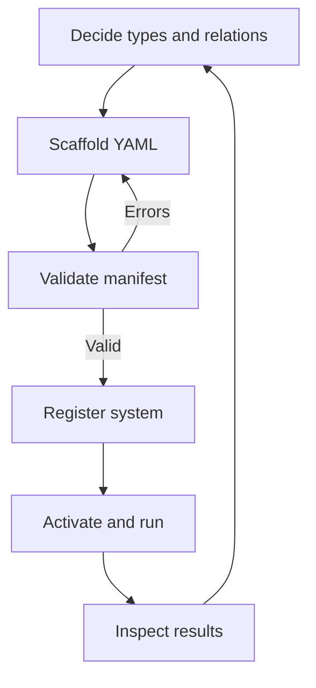

# Building a Domain Definition

This tutorial teaches you how to define your own domain in Earmark: the object types, relations, workflows, and system manifest that describe a specific kind of governed work.

## 1. Decide on Your Types

Before writing YAML, decide three things:

- **Classes**: What are the object types? For a contract review system, these might be `contract_clause`, `violation_risk`, and `review_decision`. For a research pipeline: `source_note`, `finding`, `summary`.

- **Relations**: How do objects connect? A finding is `derived_from` a source note. A review decision `reviews` a violation risk.

- **Workflow**: What is the sequence? `contract → clause → risk_report` or `source_note → finding → summary`.

Start with 2–3 classes, one relation type, and a two-stage workflow. You can add more later.

## 2. Scaffold Your Declarations

Use `em declare new` to generate templates:

```bash
mkdir -p my_domain/classes
em declare new --kind class contract --path my_domain/classes/contract.yaml
em declare new --kind class contract_clause --path my_domain/classes/clause.yaml
em declare new --kind class violation_risk --path my_domain/classes/risk.yaml
```

Edit the generated files to define your schemas, relation rules, and standing constraints. Here's what a class declaration looks like:

```yaml
name: contract_clause
version: 0.2.0
kind: object
required_headers:
  - title
payload_schema: inline:any
standing_rules:
  allowed_standing:
    kernel:epistemic:
      - working
      - supported
    kernel:review:
      - unreviewed
      - accepted
    kernel:process:
      - active
      - completed
relation_rules:
  - relation_type: extracted_from
    counterparty_classes:
      - contract
validators: []
```

## 3. Create a System Manifest

A system manifest ties your declarations together into a working domain. Create `system.yaml` at the root of your domain directory:

```yaml
system_id: my_contract_reviewer
namespace: my_org.legal
title: Contract Policy Reviewer
description: Extract clauses and flag policy violations.

classes:
  - classes/contract.yaml
  - classes/clause.yaml
  - classes/risk.yaml

instructions:
  - instructions/extract_clauses.md
  - instructions/flag_risks.md

workflows:
  - workflows/review_workflow.yaml

runtime_profile:
  execution_surface: local
  work_surface_mode: staged
```

## 4. Validate

Always validate before registering. Earmark checks for missing references, undefined classes, and schema errors:

```bash
em declare validate my_domain/system.yaml
```

If something is wrong, you'll see a specific error:

```text
Error: Class 'contract_clause' referenced by workflow 'review_workflow' is not defined in the system.
```

Fix the missing declaration or reference, then re-validate.

## 5. Register and Activate

Once valid:

```bash
em system register my_domain/system.yaml
em system activate my_contract_reviewer
```

## 6. Run

Deposit data and run your workflow:

```bash
em deposit --class contract --title "Lease Agreement" --body "..."
em query --class contract
em workflow run review_workflow --system-id my_contract_reviewer --with <object_id>
```

Use the `object_id` returned by `em query --class contract`.

## The Cycle



The loop is: design, validate, run, inspect, refine. Start small and iterate.

## Next Steps

- [CLI Reference](../reference/cli.md) — full command documentation
- [Declaration Schemas](../reference/schemas.md) — all available fields and types
- [Research Synthesis Demo](research-synthesis-demo.md) — see a complete working domain
