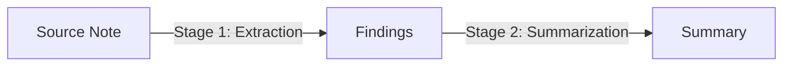

# Tutorial: Research Synthesis Demo

This tutorial walks through a complete, staged research synthesis workflow: **Source Note -> Finding -> Summary**.

It demonstrates how Earmark maintains lineage across multiple stages of work while keeping each stage's context strictly bounded.

## The Workflow Graph

In this demo, we execute two distinct transitions:



## Step 1: Setup

If you haven't already, follow the [Quickstart](quickstart.md) to initialize a workspace and register the `sys_research_synthesis` system.

Alternatively, you can run the automated setup script in the example directory:

```bash
cd examples/research-synthesis
./setup.sh
```

## Step 2: Stage 1 - Finding Extraction

We begin by taking a raw `source_note` and extracting discrete `finding` objects.

```bash
em workflow run research_synthesis --system-id sys_research_synthesis --with <source_note_id>
```

### What happens in Stage 1?
1. **Context Compilation**: The system compiles a work packet containing the `source_note` and its instructions.
2. **Execution**: The runtime processes the note and produces one or more `finding` objects.
3. **Artifact Persistence**: An **Assignment**, a **Change Set**, and a **Handoff Manifest** are created.

### Inspecting the Handoff
After Stage 1 completes, notice the `handoff_id` in the output. This manifest is the **only** thing the next stage will see.

```bash
em handoff explain <handoff_id>
```

## Step 3: Stage 2 - Summarization

Now, we continue the work using the handoff from Stage 1. 

**Crucially, the summarization stage will see the findings, but NOT the original raw source note.** This is "bounded continuation."

```bash
em workflow run research_synthesis --system-id sys_research_synthesis --handoff <handoff_id>
```

## Step 4: Full Run Inspection

Once both stages are complete, you can view the entire "Run" as a single history.

### The Timeline
See every event, from the initial assignment to the final summary deposit:

```bash
em run timeline <run_id>
```

### The Relationship Graph
Visualize the lineage from source to finding to summary:

```bash
em run graph <run_id>
```

### The HTML Report
For a shareable view of the work, generate an HTML report:

```bash
em report run <run_id> --output research_report.html
```

## Why this matters

By breaking the work into these two stages:
1. **Validation**: We can validate that the findings are discrete before we summarize them.
2. **Noise Reduction**: The summarizer is not distracted by the raw text of the source note, only the verified findings.
3. **Auditability**: If a finding is wrong, we know exactly which stage produced it and which source note it was derived from.

## Next Steps

- Learn how to [Build a Domain Definition](build-a-domain-definition.md) to define your own workflows.
- Deep dive into the [Context Compilation](../concepts/context-compilation.md) concept.
