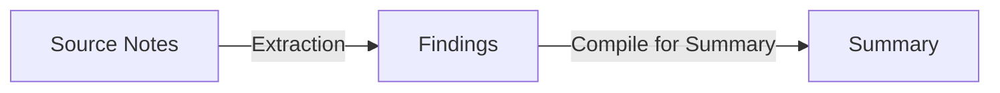

# Research Synthesis Demo

Run a complete research synthesis workflow: extract findings from source notes, then synthesize a summary from only those findings.

The key demonstration: the summarization step never sees the original source notes. The workflow engine compiles bounded work surfaces using declared compiled context templates. Each operation receives only what its template selects. The handoffs produced during execution record exactly what each successor operation may see.

## The Workflow



The research synthesis workflow performs four operations in one invocation:

1. Compile context from `source_note` objects
2. Transform compiled context into `finding` objects
3. Compile context from `finding` objects (not from the original source notes)
4. Transform compiled findings into a `summary`

Between operations, the engine produces handoffs that define the bounded surface for each successor. Step 3 and 4 never see the raw source notes — they work from the handoff produced in step 2.

## Setup

If you've already completed the [Quickstart](quickstart.md), you have a workspace with `sys_research_synthesis` registered and activated.

Otherwise, from the repository root:

```bash
cargo build -p earmark-cli
alias em="$(pwd)/target/debug/earmark-cli"
export REPO_ROOT="$(pwd)"
export WORKSPACE=/tmp/earmark-research-synthesis-tutorial
rm -rf "$WORKSPACE"

em --root "$WORKSPACE" init
em --root "$WORKSPACE" system register "$REPO_ROOT/examples/research-synthesis/declarations/systems/system.yaml"
em --root "$WORKSPACE" system activate sys_research_synthesis
```

Deposit the seed notes:

```bash
em --root "$WORKSPACE" deposit --class source_note \
  --title "Federated Graphs: Agility and Ownership" \
  --payload-file "$REPO_ROOT/examples/research-synthesis/data/seed_notes/note_1_benefits.md"

em --root "$WORKSPACE" deposit --class source_note \
  --title "The Cost of Heterogeneity" \
  --payload-file "$REPO_ROOT/examples/research-synthesis/data/seed_notes/note_2_challenges.md"
```

## Run the Workflow

Find your deposited source notes and run the workflow:

```bash
em --root "$WORKSPACE" query --class source_note
em --root "$WORKSPACE" workflow run research_synthesis --system-id sys_research_synthesis --with <source_note_id>
```

The output shows the run completed with artifacts:

```
{
  "ok": true,
  "run_id": "run_...",
  "status": "completed",
  "output_count": 2,
  "created_assignments": [...],
  "created_change_sets": [...],
  "created_handoffs": [...],
  "created_failures": []
}
```

The workflow produces findings and a summary in a single invocation. The engine compiles bounded work surfaces at each step — the summary is produced from findings only, not from the original source notes.

## Inspect Artifacts

### Queries

View the extracted findings and summary:

```bash
# See what findings were extracted
em --root "$WORKSPACE" query --class finding

# See the synthesized summary
em --root "$WORKSPACE" query --class summary
```

### Handoff Inspection

Handoffs define the bounded surface passed between operations. Inspect them to see what each successor operation was permitted to access:

```bash
# List the handoffs from the run
em --root "$WORKSPACE" run artifacts <run_id>

# Inspect a handoff to see what it carries forward
em --root "$WORKSPACE" handoff explain <handoff_id>
```

A handoff from the extraction operation carries findings and their `derived_from` relations — not the original source notes.

### Run Timeline and Graph

```bash
# Visual timeline of every event
em --root "$WORKSPACE" run timeline <run_id>

# Relationship graph from source to finding to summary
em --root "$WORKSPACE" run graph <run_id>

# Summary with suggested next steps
em --root "$WORKSPACE" run explain <run_id>
```

### HTML Report

Generate an HTML report you can open in a browser:

```bash
em --root "$WORKSPACE" report run <run_id> --output research_report.html
```

## What This Demonstrates

**Bounded compilation**: Each operation sees only what its compiled context template declares. The summarization step compiles findings, not the full corpus. The handoff record proves what was available.

**Durable artifacts**: Findings and the summary persist as objects in the store. They can be queried, inspected, and reused independently of the run that created them.

**Inspectable lineage**: Every finding has a `derived_from` relation linking it to the source note it came from. The summary links back to findings through its change set.

**Transparent execution**: The timeline, artifact inventory, and relationship graph show exactly what happened, in what order, and how artifacts connect.

## Next Steps

- [Build a Domain Definition](build-a-domain-definition.md) — define your own classes and workflows
- [Context Compilation](../concepts/context-compilation.md) — how compiled context templates control what each operation sees
